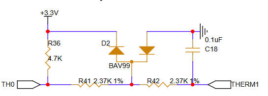

# Capteurs de température

## Thermistance

Un thermistance est facile d'utilisation. Il faut simplement la connecter en série avec une autre résistance, puis lire la tension du diviseur de tension créé. Cependant, pour un système plus poussé avec une certaine protection des I/O du microcontroleur, il est possible d'ajouter deux "small signal switching diode".

Dans ce cirsuit, la résis tance de 4.7K possède une valeur précision de (0.1%) et est utilisé pour le diviseur de tension.

Le circuit incluant le BAV99 et les résistance de 2.37K servent uniquement de protection dans l'éventualité qu'une tension en dehors de la plage offerte par la source de tension.

Le condensateur sert à se débarrasser des hautes fréquences qui pourraient nuire à la lecture de la tension.

Le NTC 3950 100K doit être en mesure d'offrir une lecture pour une température allant jusqu'à 100C.

À 25C, en utilisant les formules d'un diviseur de tension à 3.3v on lira une tension de 3.15V

À 100C on lire une tension de 0.0064V

**PRÉCISION DE L'ADC ENCORE INCONNU MAIS ON VA ASSUMER 10BITS** = 0.0032v <= VRAIMENT PAS L'IDÉAL

**ON A SOIT BESOIN D'UNE AUTRE RÉSISTANCE OU D'UN ADC 12BITS** !!!UPDATE!!! le STM32F446ZET6 est 12bits (utilisé par BTT octopus)

## RTD et MAX31865

Slice engineering suggère fortement d'utiliser un max31865 pour lire la valeur des PT1000 utilisés pour nos extrudeurs.

Nous utilisons ce setup car les températures des extrudeurs excèdent ce que les NTC3950 peuvent supporter.

Le MAX31865 nous offre une précision de 15bits et une communication SPI qui semble être 100% compatible avec klipper : [article voron sur le sujet.](https://docs.vorondesign.com/community/electronics/xbst_/PT100.html)

