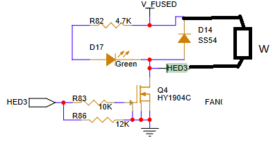

# Éléments chauffants

## Élements 50W pour les hothends (DMN4026SK3)

Le circuit présenté ci dessous provient d'un carte mère octopus fabriqué par bigtreetech

Cependant, la pin HED3 fait du level shifting à 0-12V à l'aide d'un level shifter CD4504B pour assurer que le transistor reste en triode. Un autre board utilise une strat.gie similaire mais avec un level shifter 3v3 à 5v ce qui me fait douter si le nmos reste réellement en triode ou non.

### Calculs de napkin

supposons qu'on utilise un level shifter vers 5v comme le MC1413DR2G, vgs serait d'environ de 5V, ensuite il nous faut un mosfet pouvant driver 50W, 50W/24V = 2.08A, allons vers 2.2 A pour rester safe. Si on veut utiliser un mosfet nmos en switching mode, il faut qu'il ne sature pas avec le vgs donné.

Après quelque recherches, un transistor comme le RD3P050SN, FDD8451, DMN10H220LK sont des switching transistor qui demandent de faible vgs pour driver de grande quantité de courant en Id, ils sont souvent utilisé dans des application de PWM et dc/dc converter. Certains ont même un très faible Vth (3v ish) qui nous permettrait de controler les mosfets sans même utiliser un level shifter. Cependanty on va quand même en utiliser un par soucis que le IO soit plus bas que 3v

## Pour les solid state relays (DMN65D8L-7)

Les solid states relays sont drivés par des photos diode, on peut simplement utiliser de petit mosfets pour driver allumer les octocoupleurs.
